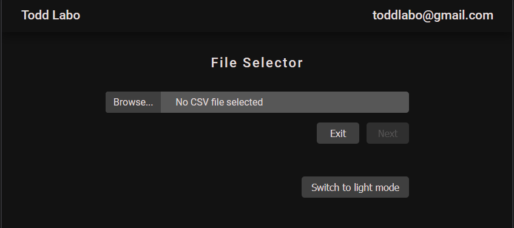

# Simple Inputfield
Technologies Used
- JavaScript
- HTML
- CSS

### Description
Aesthetically pleasing input field that allows a user to upload a file. In this instance, the file is restricted to CSV files only but is easily modified to allow for other types of files.  
Under the hood, the CSV file is uploaded via the HTML form element using a bit of misdirection.  
Added a simple dark/light toggle for the page.

---

  

---
### Lighthouse Score
 

